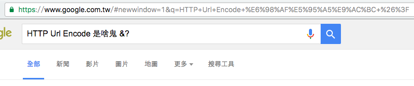

# HTTP （續）

Author: Inndy < inndy [dot] tw [at] gmail [dot] com >

Date: 2016/08/07

## URL Encode



不知道大家是否曾經注意過，使用 Google 搜尋的時候會在網址列上面看到你輸入的關鍵字，但是跟我們輸入的資料好像有點差異？

這是因為如果你輸入的資料不在 ASCII 定義的範圍內，甚至是包含了換行 `"\r\n"`，那可能會導致 HTTP request 整個壞掉，所以必須要經過某種編碼處理，讓那些怪怪的字元轉換成 ASCII 範圍內的表示方式。

轉換規則大概是這樣：

1. 如果是英文、數字、以及部分的符號（`"-_.~"` 之類的）不轉換
2. 其餘的資料以 UTF-8 （也可以是其他 text encoding，但是現在 UTF-8 是主流）編碼後，每個 byte 如果不再 (1) 的白名單上，則換成 `%FF`（其中 FF 的部分為該 byte 轉成十六進位，且補零至兩位）

並且在實作上有個特例，瀏覽器會把空白字元轉成 `"+"` ，但是也可以根據第二規則把空白（ASCII = 32, 0x20） 換成 `"%20"`

## 參數的傳遞

在 HTTP 中，有三個地方可以塞資料傳給伺服器，分別是：

1. GET 參數（網址後面以 `"?"` 分隔，問號之後的資料都是 GET 參數）
2. Request body (POST body)
3. Header（通常自定義的 Header 都會以 `X-` 開頭）

以剛剛的例子來說，Google 搜尋會把關鍵字放在 GET 參數的 `q` 裡面，例如：[`https://www.google.com/search?q=url+encode`](https://www.google.com/search?q=url+encode)

## HTTP Post 範例

這是一個從 Firefox 瀏覽器發出的 HTTP Post 範例：

```
POST /data HTTP/1.1
Host: 127.0.0.1:9999
User-Agent: Mozilla/5.0 (Macintosh; Intel Mac OS X 10.11; rv:47.0) Gecko/20100101 Firefox/47.0
Accept: text/html,application/xhtml+xml,application/xml;q=0.9,*/*;q=0.8
Accept-Language: en-US,en;q=0.5
Accept-Encoding: gzip, deflate
DNT: 1
Connection: keep-alive
Content-Type: application/x-www-form-urlencoded
Content-Length: 80

A=%E6%B8%AC%E8%A9%A6&B=Hello&C=%5E____%5E%21%21...%20%26____%26%20..%20%23___%23
```

其中的重點大概有這幾個：

```
POST /data HTTP/1.1
```

首先 `POST` 是 HTTP method (verb)，表示我們要使用 HTTP request body 傳送資料，目標的路徑是 `/data`。

```
Content-Type: application/x-www-form-urlencoded
Content-Length: 80
```

`Content-Type: application/x-www-form-urlencoded` 表示 request body 的格式是 `key=value&key2=value2` 的格式，並且經過 url encode 轉換處理，`Content-Length: 80` 表示在 `"\r\n\r\n"` 的分隔之後的 request body 有 80 bytes。

```
A=%E6%B8%AC%E8%A9%A6&B=Hello&C=%5E____%5E%21%21...%20%26____%26%20..%20%23___%23
```

經過解碼後可以得到內容是：

```
A: 測試
B: Hello
C: ^____^!!... &____& .. #___#
```

## 常見的 HTTP Header

### `Connection: Keep-alive`

request 放這個 header 表示告訴伺服器請重複使用同一個 tcp connection，節省 tcp handshake 的時間，如果 server 也支援重複利用 tcp connection 的話，也會在 response 中回應同樣的 header，相對的是 `Connection: close`，如果其中任何一方送出了這個 header，表示他不支援重複使用 tcp connection，對方就只能關掉連線

### `User-Agent`

內容包含了瀏覽器類型、版本、作業系統等資訊，可以從這裡看出來你用的瀏覽器是什麼，是哪個版本，用什麼作業系統、作業系統的版本

### `Host`

現在的 http server 幾乎都支援，在同一台機器同一個 IP 上放多個網站，並且根據連線時用的 domain name 給出不同的內容

舉例來說，`facebook.com` / `fb.com` 兩個 domain 可能會在同一台機器上（`66.220.146.36`）：

```
inndy ~$ nslookup fb.com
Server:		8.8.8.8
Address:	8.8.8.8#53

Non-authoritative answer:
Name:	fb.com
Address: 66.220.146.36

inndy ~$ nslookup facebook.com
Server:		8.8.8.8
Address:	8.8.8.8#53

Non-authoritative answer:
Name:	facebook.com
Address: 66.220.146.36
```

### `Referer`

這個 header 可能會包含在 HTTP request 裡面，內容是「來源網頁的網址」，例如你在 Google 首頁點了 Gmail 的連結，那麼 gmail.com 的 HTTP request 中就會包含 `Referer: https://www.google.com`

### `Content-Type`

表示 request body / response body 中的內容是什麼格式，例如普通的網頁會在 response header 中放 `Content-Type: text/html`，png 圖片會是： `Content-Type: image/png`，這種格式表示方式叫做 [`MIME type`](https://en.wikipedia.org/wiki/Media_type)

### `Location`

這個 header 會出現在 HTTP response 中，表示要進行轉址，`Location` 的內容是要跳轉到的網址

## 用 Python 寫一個 HTTP client

[Source Code](assets/004/http.py)

## 附錄：Web Architecture

這是我之前講課用的簡報，簡單介紹了一個網站從 front-end 到 back-end 的結構：[Web Architecture](https://speakerdeck.com/inndy/web-architecture)

## /dev/null

我真的沒有遲交喔，Las Vegas 現在的時間是 8/7 早上十點 XDDDD

## 下集預告

(nil)

---

這篇文章以 [CC BY-NC-SA 3.0](https://creativecommons.org/licenses/by-nc-sa/3.0/tw/) 授權釋出
